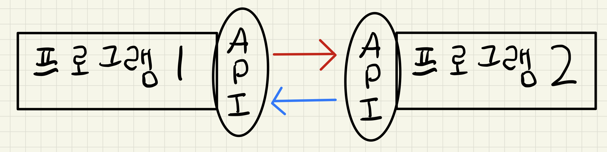

# [CS 스터디] API

작성일: 2022년 11월 23일
태그: CS

# 정의

<aside>
❓ **API(Application Programming Interface)** 는 프로그램과 프로그램 사이의 통신을 위한 인터페이스이다.

</aside>

함수, 메서드 등의 이름으로 불리는 소프트웨어 구성 요소의 정의 를 말한다. 구현과는 상관 없이, 어떻게 사용하는지( = 사양) 정의만 되어있으면 된다. 실제로 구현되어 있으면 라이브러리라고 한다.

# 웹 API

웹 환경에서 사용되는 API 를 말한다. 즉, 하나의 웹서비스가 다른 웹서비스에 요청을 보내고 응답을 받기 위한 명세를 말한다. 

<aside>
✔️  웹 상에서 어떤 요청을 보내면 어떤 응답을 받을지 정해놓은 것을 말한다.

</aside>

## RESTFull API = REST API

**REST(Representational State Transfer) : 규칙들의 집합.**

HTTP 를 이용한 프로토콜로 REST 조건들을 모두 만족하는 API 를 의미한다.

### REST 조건

- 클라이언트, 서버 및 리소스로 구성되었으며 요청이 HTTP를 통해 관리되는 **클라이언트-서버 아키텍처**
- **스테이트리스(stateless)** 클라이언트-서버 커뮤니케이션: 요청 간에 클라이언트 정보가 저장되지 않으며, 각 요청이 분리되어 있고 서로 연결되어 있지 않음
- 클라이언트-서버 상호 작용을 간소화하는 **캐시 가능** 데이터
- **자체 표현 구조** : REST API 메시지만으로 어떤 작업을 하는 API 인지 쉽게 알 수 있는 구조
- **계층형 구조** : 요청된 정보를 검색하는 데 관련된 서버(보안, 로드 밸런싱 등을 담당)의 각 유형을 클라이언트가 볼 수 없는 계층 구조로 체계화하는 계층화된 시스템.
- **코드 온디맨드(선택 사항**): 요청을 받으면 서버에서 클라이언트로 실행 가능한 코드를 전송하여 클라이언트 기능을 확장할 수 있는 기능.