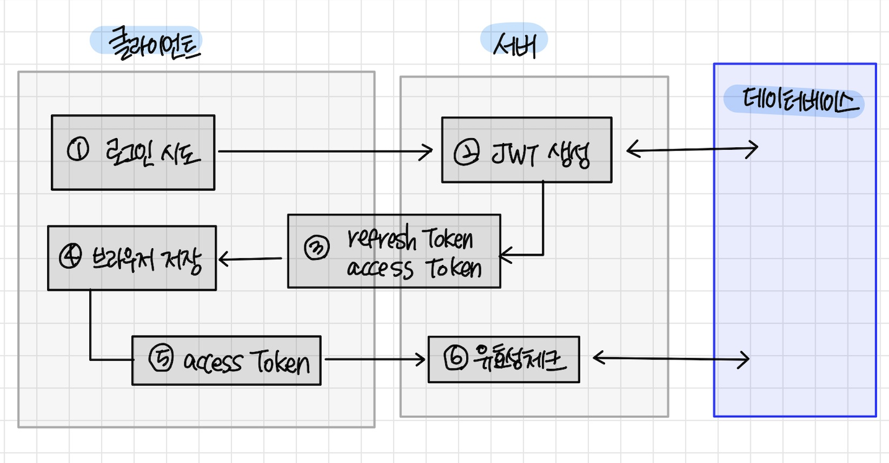

# [CS 스터디] JWT

작성일: 2022년 11월 23일
태그: CS

# JWT

JSON Web Token 의 약자. RFC 7519 표준으로 정의되어 있는 전자 서명된 URL-safe 한 JSON 이다.

⇒ 웹 환경에서 사용자 인증을 위한 토큰

⇒ HTTP 는 무상태, 각각의 요청-응답 쌍이 독립적이므로, 사용자의 인증을 위해서는 별도의 정보 유지 수단이 필요하다.

⇒ 그 “정보 유지 수단” 의 한 종류로서 Token 이 있고 그 중 한 종류가 JWT 이다.

## 구조

```java
Header.Payload.Signature
```

### Header

JWT를 어떻게 검증하는지에 대한 정보가 포함되어있다. 암호화 알고리즘과 토큰의 타입이 포함되어있다.

```json
{
	"alg": "HSA256",
	"typ": "JWT"
}
```

### Payload

- 토큰에 담고자 하는 정보를 넣는 부분이다.
- JSON 의 각 key-value 를 claim(클레임) 이라 부른다.
- claim 에는 3가지 종류가 있다.
    - Registered : 표준에 이미 정의된 클레임들. 모두 사용할 필요는 없다.
        - `iss` (issuer): JWT 를 발급한 발급자
        - `sub` (subject): Subject of the JWT (the user)
        - `aud` (*audience*):  JWT 를 받을 수신자
        - `exp` (expiration time): JWT 만료 시간
        - `nbf` (not before time): JWT 유효 시작 시간
        - `iat` (issued at time): JWT 발급시간. JWT의 수명을 결정하는데 사용할 수 있다.
        - `jti` (JWT ID): JWT의 고유 식별자. JWT 재사용 방지를 위해 사용할 수 있다.
    - Public : 다른 토큰에 이 클레임과 같은 클레임이 있으면 안된다. = 충돌 방지 필요
    - Private : 다른 토큰에 이 클레임과 같은 클레임이 있어도 된다. = 충돌 가능

```json
{
  "roles": [
    "ROLE_MEMBER"
  ],
  "iss": "oclock",
  "exp": 1669214385,
  "iat": 1669207185,
  "userKey": 1
}
```

### Signature

헤더와 페이로드를 합친 문자열을 헤더에 정의된 알고리즘과 발급자만 아는 비밀키를 이용해 서명한것.

헤더, 페이로드, 시그니처 모두 base64 URL-safe 인코딩한다. 그후 “.” 을 구분자로 하여 이어붙인다.

## JWT 의 장점

**자체 인증이 가능하다는 점이 장점**이다. 

흔한 문서에서 세션 방식과 비교해 서버 부하가 적다는 점을 장점으로 이야기 하나, 이는 JWT 자체의 장점이 아니라 JWT를 클라이언트에만 저장할 때의 장점이다. **JWT 표준 자체에선 JWT 의 저장방식을 규정하고 있지 않다.** 

## JWT 를 이용한  인증 시스템 구조 예시

1. 단일 토큰(=엑세스 토큰) 만을 이용한 인증 구조
    
    
    
2. 이중 토큰(= 엑세스 토큰 + 리프레쉬 토큰) 을 이용한 인증 구조
    
    
    

## JWT 를 이용한 인증 시스템에서 고려해야 할 점들

1. 토큰이 탈취된 경우에 대한 대응책 
    1. JWT 표준에 의한 토큰 자체의 유효성 검증 이외에 추가적으로 탈취되었는지 여부를 확인할 수 있도록 구성한다. 
    2. 엑세스 토큰과 리프레쉬 토큰의 2가지 토큰을 사용하는 방식은 기본적으로 엑세스 토큰의 유효기간을 짧게 하여 엑세스 토큰이 탈취되어도 금방 인증이 풀리도록 하는 구조다. 
    3. 좀 더 보안을 강화하기 위해 두 토큰을 서로 연결시키는 구조로 사용하는 경우나, 아예 서버에 토큰을 저장하여 추가 검증을 진행하는 경우도 있다.
2. 최대한 토큰이 탈취되지 않도록 하는 방지책
    
    ⇒ 토큰을 저장하는 위치가 중요하다.
    
    - 로컬 스토리지 & 세션 스토리지 : 브라우저 내의 JS로 접근이 가능하다. XSS 공격에 취약하다.
    - HTTP Only 쿠키 : 브라우저 내의 JS 로 접근이 불가능하다. SOP 정책에 의해 문제가 생길 가능성이 있다.

[[JWT] JWT 보안에 대한 고찰](https://velog.io/@cham/JWT-JWT-%EB%B3%B4%EC%95%88%EC%97%90-%EB%8C%80%ED%95%9C-%EA%B3%A0%EC%B0%B0)