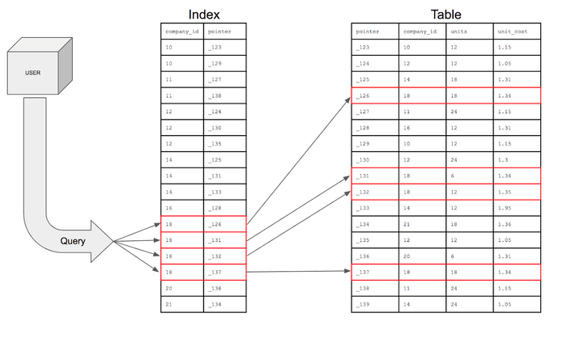

# [CS 스터디] DB 인덱스

작성일: 2022년 12월 22일
태그: CS, DB

## 인덱스란?

DB의 테이블의 동작속도를 향상시키기 위해 DBMS 내부에서 사용하는 자료구조. 책의 목차나 색인과 같은 역할을 한다. 

  
  인덱스 이미지 출처 :
  <a href="https://mangkyu.tistory.com/96">https://mangkyu.tistory.com/96</a>

테이블의 각 row 들은 별도로 정렬되어있지 않고 아무렇게나 삽입되어 있다. 따라서, 테이블에 특정 행을 조회하는 경우 테이블 전체를 탐색하는 FULL-SCAN 이 발생하게 된다.

테이블의 특정 컬럼에 인덱스를 생성하면, 인덱스 테이블이 생성되는데, 이 인덱스 테이블은 key-value 형태를 가진다. 이때 key 는 인덱스를 설정한 컬럼의 데이터가 되고, value 는 원본 테이블의 각 row 를 가리키는 pointer 가 된다. 중요한 점은, 인덱스 테이블은 정렬되어있다는 점이다. 따라서, 인덱스를 사용하면 FULL-SCAN 이 발생하지 않고 인덱스를 이용해 빠르게 검색할 수 있게 됩니다.

### 인덱스를 사용할때의 장점

- 검색이 빨라진다.
    1. select 쿼리를 이용한 조회뿐 아니라, update, delete 연산의 속도도 소폭 향상될 수 있다.
    2. 수정과 삭제작업 역시 일단 조회를 해야 할 수 있는 연산이기 때문이다.

### 인덱스를 사용할 때의 단점

- 용량이 증가한다.
    - 인덱스 테이블을 별도로 생성하기 때문에, 10% 내외의 저장공간을 더 필요하게 된다.
- 잘못된 인덱스 사용은 오히려 성능의 감소를 불러오게 된다.
    - 삽입, 삭제, 수정의 작업에서 원본테이블과 인덱스 테이블 모두 수정사항이 반영되어야 한다.
    - 이 때, 인덱스 테이블은 정렬된 상태를 유지하기 위해 추가 작업이 진행되게 되고, 이는 성능 저하를 불러올 수 있다.

### 인덱스를 설정할때 고려해야 할 점

1. 쿼리를 더 효율적으로 작성할 방법은 없는지 생각한다.
2. 해당 테이블이 조회가 자주 발생하고, 변경은 적게 발생하는 테이블인지 확인 한다.
3. Cardinality 가 높은 컬럼에 인덱스를 걸어준다.
    1. Cardinality : 컬럼이 유니크한(중복되지 않은) 값을 가지는 정도. 높을수록 해당 컬럼은 서로 다른  행이 같은 값을 가지는 경우가 적다.
    2. “성별” 컬럼은 남,여 2개의 값만 가지므로 Cardinality가 낮다. 반면, “이메일” 컬럼은 수많은 값을 가지므로 Cardinality 가 높다.

## DBMS 가 인덱스를 구현할 때 사용하는 자료구조

### 해쉬테이블

O(1) 이라는 기상천외한 속도로 원하는 자료에 접근할 수 있는 자료구조이지만, DBMS 에서 일반적으로 잘 사용하지 않는다. DB 의 접근에서는 = 연산보단 <, > 등의 연산이 훨씬 자주 사용되고 이런 연산은 정렬을 보장하지 않는 해쉬테이블에서 사용할 수 없기 때문이다.

### BTree

이진 탐색 트리의 단점인 “불균형 상태에 빠질 경우 성능의 하락”을 해결하기 위해 고안된 자료구조.

[[자료구조] B-트리(B-Tree)란? B트리 그림으로 쉽게 이해하기, B트리 탐색, 삽입, 삭제 과정](https://code-lab1.tistory.com/217)

특징

특정 데이터 한개를 검색하는데 용이하다. (전체적으로 균형잡힌 이진트리에서의 연산과 속도가 같다)

여러 데이터를 탐색하는 경우, 각각의 데이터를 따로따로 검색해야 한다. ⇒ 검색에 불리하다.

### B+Tree

B트리의 단점인 여러 데이터를 한꺼번에 탐색이 불가능한 점을 개선한 자료구조.

[[자료구조] 그림으로 알아보는 B+Tree](https://velog.io/@emplam27/%EC%9E%90%EB%A3%8C%EA%B5%AC%EC%A1%B0-%EA%B7%B8%EB%A6%BC%EC%9C%BC%EB%A1%9C-%EC%95%8C%EC%95%84%EB%B3%B4%EB%8A%94-B-Plus-Tree)

특징

리프노드들에만 데이터가 저장되어있고, 이 리프 노드들이 연결리스트로 연결되어있다. 따라서 여러 데이터를 한꺼번에 가져올 수 있다.

⇒ <b>대부분의 DB 엔진이 인덱스의 구현에 B+트리를 사용한다.</b>